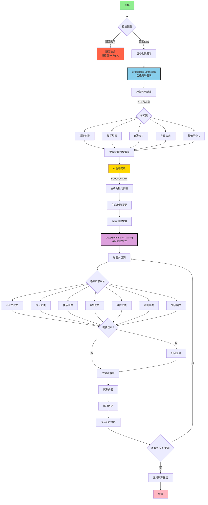

# MindSpider - 专为舆情分析设计的AI爬虫

> 免责声明：
> 本仓库的所有内容仅供学习和参考之用，禁止用于商业用途。任何人或组织不得将本仓库的内容用于非法用途或侵犯他人合法权益。本仓库所涉及的爬虫技术仅用于学习和研究，不得用于对其他平台进行大规模爬虫或其他非法行为。对于因使用本仓库内容而引起的任何法律责任，本仓库不承担任何责任。使用本仓库的内容即表示您同意本免责声明的所有条款和条件。

## 项目概述

MindSpider是一个基于Agent技术的智能舆情爬虫系统，通过AI自动识别热点话题，并在多个社交媒体平台进行精准的内容爬取。系统采用模块化设计，能够实现从话题发现到内容收集的全自动化流程。

两步走爬取：

- 模块一：Search Agent从包括微博、知乎、github、酷安等 **13个** 社媒平台、技术论坛识别热点新闻，并维护一个每日话题分析表。
- 模块二：全平台爬虫深度爬取每个话题的细粒度舆情反馈。

### 技术架构

- **编程语言**: Python 3.9+
- **AI框架**: 默认Deepseek，可以接入多种api (话题提取与分析)
- **爬虫框架**: Playwright (浏览器自动化)
- **数据库**: MySQL (数据持久化存储)
- **并发处理**: AsyncIO (异步并发爬取)

## 项目结构

```
MindSpider/
├── BroadTopicExtraction/           # 话题提取模块
│   ├── database_manager.py         # 数据库管理器
│   ├── get_today_news.py          # 新闻采集器
│   ├── main.py                    # 模块主入口
│   └── topic_extractor.py         # AI话题提取器
│
├── DeepSentimentCrawling/         # 深度爬取模块
│   ├── keyword_manager.py         # 关键词管理器
│   ├── main.py                   # 模块主入口
│   ├── platform_crawler.py       # 平台爬虫管理器
│   └── MediaCrawler/             # 多平台爬虫核心
│       ├── base/                 # 基础类
│       ├── cache/                # 缓存系统
│       ├── config/               # 配置文件
│       ├── media_platform/       # 各平台实现
│       │   ├── bilibili/        # B站爬虫
│       │   ├── douyin/          # 抖音爬虫
│       │   ├── kuaishou/        # 快手爬虫
│       │   ├── tieba/           # 贴吧爬虫
│       │   ├── weibo/           # 微博爬虫
│       │   ├── xhs/             # 小红书爬虫
│       │   └── zhihu/           # 知乎爬虫
│       ├── model/               # 数据模型
│       ├── proxy/               # 代理管理
│       ├── store/               # 存储层
│       └── tools/               # 工具集
│
├── schema/                       # 数据库架构
│   ├── db_manager.py            # 数据库管理
│   ├── init_database.py         # 初始化脚本
│   └── mindspider_tables.sql    # 表结构定义
│
├── config.py                    # 全局配置文件
├── main.py                      # 系统主入口
├── requirements.txt             # 依赖列表
└── README.md                    # 项目文档
```

## 系统工作流程

### 整体架构流程图



### 工作流程说明

#### 1. BroadTopicExtraction（话题提取模块）

该模块负责每日热点话题的自动发现和提取：

1. **新闻采集**：从多个主流平台（微博、知乎、B站等）自动采集热点新闻
2. **AI分析**：使用DeepSeek API对新闻进行智能分析
3. **话题提取**：自动识别热点话题并生成相关关键词
4. **数据存储**：将话题和关键词保存到MySQL数据库

#### 2. DeepSentimentCrawling（深度爬取模块）

基于提取的话题关键词，在各大社交平台进行深度内容爬取：

1. **关键词加载**：从数据库读取当日提取的关键词
2. **平台爬取**：使用Playwright在7大平台进行自动化爬取
3. **内容解析**：提取帖子、评论、互动数据等
4. **情感分析**：对爬取内容进行情感倾向分析
5. **数据持久化**：将所有数据结构化存储到数据库

## 数据库架构

### 核心数据表

1. **daily_news** - 每日新闻表
   - 存储从各平台采集的热点新闻
   - 包含标题、链接、描述、排名等信息

2. **daily_topics** - 每日话题表
   - 存储AI提取的话题和关键词
   - 包含话题名称、描述、关键词列表等

3. **topic_news_relation** - 话题新闻关联表
   - 记录话题与新闻的关联关系
   - 包含关联度得分

4. **crawling_tasks** - 爬取任务表
   - 管理各平台的爬取任务
   - 记录任务状态、进度、结果等

5. **平台内容表**（继承自MediaCrawler）
   - xhs_note - 小红书笔记
   - douyin_aweme - 抖音视频
   - kuaishou_video - 快手视频
   - bilibili_video - B站视频
   - weibo_note - 微博帖子
   - tieba_note - 贴吧帖子
   - zhihu_content - 知乎内容

## 安装部署

### 环境要求

- Python 3.9 或更高版本
- MySQL 5.7 或更高版本
- Conda环境：pytorch_python11（推荐）
- 操作系统：Windows/Linux/macOS

### 1. 克隆项目

```bash
git clone https://github.com/yourusername/MindSpider.git
cd MindSpider
```

### 2. 创建并激活Conda环境

```bash
conda create -n pytorch_python11 python=3.11
conda activate pytorch_python11
```

### 3. 安装依赖

```bash
# 安装Python依赖
pip install -r requirements.txt

# 安装Playwright浏览器驱动
playwright install
```

### 4. 配置系统

编辑 `config.py` 文件，设置数据库和API配置：

```python
# MySQL数据库配置
DB_HOST = "your_database_host"
DB_PORT = 3306
DB_USER = "your_username"
DB_PASSWORD = "your_password"
DB_NAME = "mindspider"
DB_CHARSET = "utf8mb4"

# DeepSeek API密钥
DEEPSEEK_API_KEY = "your_deepseek_api_key"
```

### 5. 初始化系统

```bash
# 检查系统状态
python main.py --status

# 初始化数据库表
python main.py --setup
```

## 使用指南

### 完整流程

```bash
# 1. 运行话题提取（获取热点新闻和关键词）
python main.py --broad-topic

# 2. 运行爬虫（基于关键词爬取各平台内容）
python main.py --deep-sentiment --test

# 或者一次性运行完整流程
python main.py --complete --test
```

### 单独使用模块

```bash
# 只获取今日热点和关键词
python main.py --broad-topic

# 只爬取特定平台
python main.py --deep-sentiment --platforms xhs dy --test

# 指定日期
python main.py --broad-topic --date 2024-01-15
```

## 爬虫配置（重要）

### 平台登录配置

**首次使用每个平台都需要登录，这是最关键的步骤：**

1. **小红书登录**
```bash
# 测试小红书爬取（会弹出二维码）
python main.py --deep-sentiment --platforms xhs --test
# 用小红书APP扫码登录，登录成功后会自动保存状态
```

2. **抖音登录**
```bash
# 测试抖音爬取
python main.py --deep-sentiment --platforms dy --test
# 用抖音APP扫码登录
```

3. **其他平台同理**
```bash
# 快手
python main.py --deep-sentiment --platforms ks --test

# B站
python main.py --deep-sentiment --platforms bili --test

# 微博
python main.py --deep-sentiment --platforms wb --test

# 贴吧
python main.py --deep-sentiment --platforms tieba --test

# 知乎
python main.py --deep-sentiment --platforms zhihu --test
```

### 登录问题排除

**如果登录失败或卡住：**

1. **检查网络**：确保能正常访问对应平台
2. **关闭无头模式**：编辑 `DeepSentimentCrawling/MediaCrawler/config/base_config.py`
   ```python
   HEADLESS = False  # 改为False，可以看到浏览器界面
   ```
3. **手动处理验证**：有些平台可能需要手动滑动验证码
4. **重新登录**：删除 `DeepSentimentCrawling/MediaCrawler/browser_data/` 目录重新登录

### 爬取参数调整

在实际使用前建议调整爬取参数：

```bash
# 小规模测试（推荐先这样测试）
python main.py --complete --test

# 调整爬取数量
python main.py --complete --max-keywords 20 --max-notes 30
```

### 高级功能

#### 1. 指定日期操作
```bash
# 提取指定日期的话题
python main.py --broad-topic --date 2024-01-15

# 爬取指定日期的内容
python main.py --deep-sentiment --date 2024-01-15
```

#### 2. 指定平台爬取
```bash
# 只爬取小红书和抖音
python main.py --deep-sentiment --platforms xhs dy --test

# 爬取所有平台的特定数量内容
python main.py --deep-sentiment --max-keywords 30 --max-notes 20
```

## 常用参数

```bash
--status              # 检查项目状态
--setup               # 初始化项目
--broad-topic         # 话题提取
--deep-sentiment      # 爬虫模块
--complete            # 完整流程
--test                # 测试模式（少量数据）
--platforms xhs dy    # 指定平台
--date 2024-01-15     # 指定日期
```

## 支持的平台

| 代码 | 平台 | 代码 | 平台 |
|-----|-----|-----|-----|
| xhs | 小红书 | wb | 微博 |
| dy | 抖音 | tieba | 贴吧 |
| ks | 快手 | zhihu | 知乎 |
| bili | B站 | | |

## 常见问题

### 1. 爬虫登录失败
```bash
# 问题：二维码不显示或登录失败
# 解决：关闭无头模式，手动登录
# 编辑：DeepSentimentCrawling/MediaCrawler/config/base_config.py
HEADLESS = False

# 重新运行登录
python main.py --deep-sentiment --platforms xhs --test
```

### 2. 数据库连接失败
```bash
# 检查配置
python main.py --status

# 检查config.py中的数据库配置是否正确
```

### 3. playwright安装失败
```bash
# 重新安装
pip install playwright
playwright install
```

### 4. 爬取数据为空
- 确保平台已经登录成功
- 检查关键词是否存在（先运行话题提取）
- 使用测试模式验证：`--test`

### 5. API调用失败
- 检查DeepSeek API密钥是否正确
- 确认API额度是否充足

## 注意事项

1. **首次使用必须先登录各平台**
2. **建议先用测试模式验证**
3. **遵守平台使用规则**
4. **仅供学习研究使用**

## 项目开发指南

### 扩展新的新闻源

在 `BroadTopicExtraction/get_today_news.py` 中添加新的新闻源：

```python
async def get_new_platform_news(self) -> List[Dict]:
    """获取新平台的热点新闻"""
    # 实现新闻采集逻辑
    pass
```

### 扩展新的爬虫平台

1. 在 `DeepSentimentCrawling/MediaCrawler/media_platform/` 下创建新平台目录
2. 实现平台的核心功能模块：
   - `client.py`: API客户端
   - `core.py`: 爬虫核心逻辑
   - `login.py`: 登录逻辑
   - `field.py`: 数据字段定义

### 数据库扩展

如需添加新的数据表或字段，请更新 `schema/mindspider_tables.sql` 并运行：

```bash
python schema/init_database.py
```

## 性能优化建议

1. **数据库优化**
   - 定期清理历史数据
   - 为高频查询字段建立索引
   - 考虑使用分区表管理大量数据

2. **爬取优化**
   - 合理设置爬取间隔避免被限制
   - 使用代理池提高稳定性
   - 控制并发数避免资源耗尽

3. **系统优化**
   - 使用Redis缓存热点数据
   - 异步任务队列处理耗时操作
   - 定期监控系统资源使用

## API接口说明

系统提供Python API供二次开发：

```python
from BroadTopicExtraction import BroadTopicExtraction
from DeepSentimentCrawling import DeepSentimentCrawling

# 话题提取
async def extract_topics():
    extractor = BroadTopicExtraction()
    result = await extractor.run_daily_extraction()
    return result

# 内容爬取
def crawl_content():
    crawler = DeepSentimentCrawling()
    result = crawler.run_daily_crawling(
        platforms=['xhs', 'dy'],
        max_keywords=50,
        max_notes=30
    )
    return result
```

## 许可证

本项目仅供学习研究使用，请勿用于商业用途。使用本项目时请遵守相关法律法规和平台服务条款。

---

**MindSpider** - 让AI助力舆情洞察，智能化内容分析的得力助手
