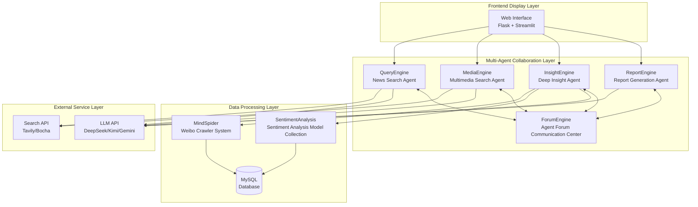

<div align="center">

# 📊 Weibo Public Opinion Multi-Agent Analysis System


[](https://github.com/666ghj/Weibo_PublicOpinion_AnalysisSystem/stargazers)
[](https://github.com/666ghj/Weibo_PublicOpinion_AnalysisSystem/network)
[](https://github.com/666ghj/Weibo_PublicOpinion_AnalysisSystem/issues)
[](https://github.com/666ghj/Weibo_PublicOpinion_AnalysisSystem/blob/main/LICENSE)

[English](./README-EN.md) | [中文文档](./README.md)

</div>

<div align="center">

</div>

## 📝 Project Overview

**Weibo Public Opinion Multi-Agent Analysis System** is an innovative public opinion analysis platform built from scratch, utilizing multi-agent collaborative architecture to provide accurate, real-time, and comprehensive Weibo public opinion monitoring and analysis services. The system achieves full-process automation from data collection and sentiment analysis to report generation through the collaboration of five specialized AI agents.

### 🚀 Key Features

- **Multi-Agent Collaborative Architecture**: 5 specialized agents working together to complete the full process of public opinion analysis
- **Comprehensive Data Collection**: Integrating Weibo crawlers, news search, multimedia content, and other multi-dimensional data sources
- **Deep Sentiment Analysis**: Precise multilingual sentiment recognition based on fine-tuned BERT/GPT-2/Qwen models
- **Intelligent Report Generation**: Automatically generate structured HTML analysis reports with custom template support
- **Agent Forum Communication**: ForumEngine provides information sharing and collaborative decision-making platform for agents
- **High-Performance Asynchronous Processing**: Support concurrent processing of multiple public opinion tasks with real-time status monitoring
- **Cloud Data Support**: Convenient cloud database service with 100,000+ daily real data

## 🏗️ System Architecture

### Overall Architecture Diagram



### Agent Collaboration Workflow

The system's core workflow is based on multi-agent collaboration:

1. **QueryEngine (News Query Agent)**: Uses Tavily API to search authoritative news reports, providing official information sources
2. **MediaEngine (Multimedia Search Agent)**: Conducts multimodal content search through Bocha API to gather social media perspectives
3. **InsightEngine (Deep Insight Agent)**: Queries local Weibo database, combines multiple sentiment analysis models for deep analysis
4. **ForumEngine (Forum Monitoring Agent)**: Real-time monitoring of agent log outputs, extracts key information and promotes collaboration
5. **ReportEngine (Report Generation Agent)**: Based on analysis results from all agents, uses Gemini LLM to generate comprehensive HTML reports

### Project Code Structure

```
Weibo_PublicOpinion_AnalysisSystem/
├── QueryEngine/                    # News Query Engine Agent
│   ├── agent.py                   # Agent main logic
│   ├── llms/                      # LLM interface wrapper
│   ├── nodes/                     # Processing nodes
│   ├── tools/                     # Search tools
│   └── utils/                     # Utility functions
├── MediaEngine/                    # Multimedia Search Engine Agent
│   ├── agent.py                   # Agent main logic
│   ├── llms/                      # LLM interfaces
│   ├── tools/                     # Search tools
│   └── ...                       # Other modules
├── InsightEngine/                 # Data Insight Engine Agent
│   ├── agent.py                   # Agent main logic
│   ├── llms/                      # LLM interface wrapper
│   │   ├── deepseek.py           # DeepSeek API
│   │   ├── kimi.py               # Kimi API
│   │   ├── openai_llm.py         # OpenAI format API
│   │   └── base.py               # LLM base class
│   ├── nodes/                     # Processing nodes
│   │   ├── first_search_node.py  # First search node
│   │   ├── reflection_node.py    # Reflection node
│   │   ├── summary_nodes.py      # Summary nodes
│   │   ├── search_node.py        # Search node
│   │   ├── sentiment_node.py     # Sentiment analysis node
│   │   └── insight_node.py       # Insight generation node
│   ├── tools/                     # Database query and analysis tools
│   │   ├── media_crawler_db.py   # Database query tool
│   │   └── sentiment_analyzer.py # Sentiment analysis integration tool
│   ├── state/                     # State management
│   │   ├── __init__.py
│   │   └── state.py              # Agent state definition
│   ├── prompts/                   # Prompt templates
│   │   ├── __init__.py
│   │   └── prompts.py            # Various prompts
│   └── utils/                     # Utility functions
│       ├── __init__.py
│       ├── config.py             # Configuration management
│       └── helpers.py            # Helper functions
├── ReportEngine/                  # Report Generation Engine Agent
│   ├── agent.py                   # Agent main logic
│   ├── llms/                      # LLM interfaces
│   │   └── gemini.py             # Gemini API dedicated
│   ├── nodes/                     # Report generation nodes
│   │   ├── template_selection.py # Template selection node
│   │   └── html_generation.py    # HTML generation node
│   ├── report_template/           # Report template library
│   │   ├── 社会公共热点事件分析.md
│   │   ├── 商业品牌舆情监测.md
│   │   └── ...                   # More templates
│   └── flask_interface.py         # Flask API interface
├── ForumEngine/                   # Forum Communication Engine Agent
│   └── monitor.py                 # Log monitoring and forum management
├── MindSpider/                    # Weibo Crawler System
│   ├── main.py                    # Crawler main program
│   ├── BroadTopicExtraction/      # Topic extraction module
│   │   ├── get_today_news.py     # Today's news fetching
│   │   └── topic_extractor.py    # Topic extractor
│   ├── DeepSentimentCrawling/     # Deep sentiment crawling
│   │   ├── MediaCrawler/         # Media crawler core
│   │   └── platform_crawler.py  # Platform crawler management
│   └── schema/                    # Database schema
│       └── init_database.py      # Database initialization
├── SentimentAnalysisModel/        # Sentiment Analysis Model Collection
│   ├── WeiboSentiment_Finetuned/  # Fine-tuned BERT/GPT-2 models
│   ├── WeiboMultilingualSentiment/ # Multilingual sentiment analysis
│   ├── WeiboSentiment_SmallQwen/   # Small Qwen model
│   └── WeiboSentiment_MachineLearning/ # Traditional machine learning methods
├── SingleEngineApp/               # Individual Agent Streamlit apps
│   ├── query_engine_streamlit_app.py
│   ├── media_engine_streamlit_app.py
│   └── insight_engine_streamlit_app.py
├── templates/                     # Flask templates
│   └── index.html                # Main interface template
├── static/                        # Static resources
├── logs/                         # Runtime log directory
├── app.py                        # Flask main application entry
├── config.py                     # Global configuration file
└── requirements.txt              # Python dependency list
```

## 🚀 Quick Start

### System Requirements

- **Operating System**: Windows 10/11 (Linux/macOS also supported)
- **Python Version**: 3.11+
- **Conda**: Anaconda or Miniconda
- **Database**: MySQL 8.0+ (or choose our cloud database service)
- **Memory**: 8GB+ recommended

### 1. Create Conda Environment

```bash
# Create conda environment named pytorch_python11
conda create -n pytorch_python11 python=3.11
conda activate pytorch_python11
```

### 2. Install Dependencies

```bash
# Install basic dependencies
pip install -r requirements.txt

# If you need local sentiment analysis functionality, install PyTorch
# CPU version
pip install torch torchvision torchaudio

# CUDA 11.8 version (if you have GPU)
pip install torch torchvision torchaudio --index-url https://download.pytorch.org/whl/cu118

# Install transformers and other AI-related dependencies
pip install transformers scikit-learn xgboost
```

### 3. Install Playwright Browser Drivers

```bash
# Install browser drivers (for crawler functionality)
playwright install chromium
```

### 4. System Configuration

#### 4.1 Configure API Keys

Edit the `config.py` file and fill in your API keys:

```python
# MySQL Database Configuration
DB_HOST = "localhost"
DB_PORT = 3306
DB_USER = "your_username"
DB_PASSWORD = "your_password"
DB_NAME = "weibo_analysis"
DB_CHARSET = "utf8mb4"

# DeepSeek API (Apply at: https://www.deepseek.com/)
DEEPSEEK_API_KEY = "your_deepseek_api_key"

# Tavily Search API (Apply at: https://www.tavily.com/)
TAVILY_API_KEY = "your_tavily_api_key"

# Kimi API (Apply at: https://www.kimi.com/)
KIMI_API_KEY = "your_kimi_api_key"

# Gemini API (Apply at: https://api.chataiapi.com/)
GEMINI_API_KEY = "your_gemini_api_key"

# Bocha Search API (Apply at: https://open.bochaai.com/)
BOCHA_Web_Search_API_KEY = "your_bocha_api_key"

# Silicon Flow API (Apply at: https://siliconflow.cn/)
GUIJI_QWEN3_API_KEY = "your_guiji_api_key"
```

#### 4.2 Database Initialization

**Option 1: Use Local Database**
```bash
# Local MySQL database initialization
cd MindSpider
python schema/init_database.py
```

**Option 2: Use Cloud Database Service (Recommended)**

We provide convenient cloud database service with 100,000+ daily real Weibo data, currently **free application** during the promotion period!

- Real Weibo data, updated in real-time
- Pre-processed sentiment annotation data
- Multi-dimensional tag classification
- High-availability cloud service
- Professional technical support

**Contact us to apply for free cloud database access: 📧 670939375@qq.com**

### 5. Launch System

#### 5.1 Complete System Launch (Recommended)

```bash
# In project root directory, activate conda environment
conda activate pytorch_python11

# Start main application (automatically starts all agents)
python app.py
```

Visit http://localhost:5000 to use the complete system

#### 5.2 Launch Individual Agents

```bash
# Start QueryEngine
streamlit run SingleEngineApp/query_engine_streamlit_app.py --server.port 8503

# Start MediaEngine  
streamlit run SingleEngineApp/media_engine_streamlit_app.py --server.port 8502

# Start InsightEngine
streamlit run SingleEngineApp/insight_engine_streamlit_app.py --server.port 8501
```

#### 5.3 Standalone Crawler System

```bash
# Enter crawler directory
cd MindSpider

# Project initialization
python main.py --setup

# Run complete crawler workflow
python main.py --complete --date 2024-01-20

# Run topic extraction only
python main.py --broad-topic --date 2024-01-20

# Run deep crawling only
python main.py --deep-sentiment --platforms xhs dy wb
```

## 💾 Database Configuration

### Local Database Configuration

1. **Install MySQL 8.0+**
2. **Create Database**:
   ```sql
   CREATE DATABASE weibo_analysis CHARACTER SET utf8mb4 COLLATE utf8mb4_unicode_ci;
   ```
3. **Run Initialization Script**:
   ```bash
   cd MindSpider
   python schema/init_database.py
   ```

### Auto-Crawling Configuration

Configure automatic crawling tasks for continuous data updates:

```python
# Configure crawler parameters in MindSpider/config.py
CRAWLER_CONFIG = {
    'max_pages': 200,         # Maximum pages to crawl
    'delay': 1,               # Request delay (seconds)
    'timeout': 30,            # Timeout (seconds)
    'platforms': ['xhs', 'dy', 'wb', 'bili'],  # Crawling platforms
    'daily_keywords': 100,    # Daily keywords count
    'max_notes_per_keyword': 50,  # Max content per keyword
    'use_proxy': False,       # Whether to use proxy
}
```

### Cloud Database Service (Recommended)

**Why Choose Our Cloud Database Service?**

- **Rich Data Sources**: 100,000+ daily real Weibo data covering hot topics across all industries
- **High-Quality Annotations**: Professional team manually annotated sentiment data with 95%+ accuracy
- **Multi-Dimensional Analysis**: Including topic classification, sentiment tendency, influence scoring and other multi-dimensional tags
- **Real-Time Updates**: 24/7 continuous data collection ensuring timeliness
- **Technical Support**: Professional team providing technical support and customization services

**Application Method**:
📧 Email Contact: 670939375@qq.com
📝 Email Subject: Apply for Weibo Public Opinion Cloud Database Access
📝 Email Content: Please describe your use case and expected data volume requirements

**Promotion Period Benefits**:
- Free basic cloud database access
- Free technical support and deployment guidance
- Priority access to new features

## ⚙️ Advanced Configuration

### Modify Key Parameters

#### Agent Configuration Parameters

Each agent has dedicated configuration files that can be adjusted according to needs:

```python
# QueryEngine/utils/config.py
class Config:
    max_reflections = 2           # Reflection rounds
    max_search_results = 15       # Maximum search results
    max_content_length = 8000     # Maximum content length
    
# MediaEngine/utils/config.py  
class Config:
    comprehensive_search_limit = 10  # Comprehensive search limit
    web_search_limit = 15           # Web search limit
    
# InsightEngine/utils/config.py
class Config:
    default_search_topic_globally_limit = 200    # Global search limit
    default_get_comments_limit = 500             # Comment retrieval limit
    max_search_results_for_llm = 50              # Max results for LLM
```

#### Sentiment Analysis Model Configuration

```python
# InsightEngine/tools/sentiment_analyzer.py
SENTIMENT_CONFIG = {
    'model_type': 'multilingual',     # Options: 'bert', 'multilingual', 'qwen'
    'confidence_threshold': 0.8,      # Confidence threshold
    'batch_size': 32,                 # Batch size
    'max_sequence_length': 512,       # Max sequence length
}
```

### Integrate Different LLM Models

The system supports multiple LLM providers, switchable in each agent's configuration:

```python
# Configure in each Engine's utils/config.py
class Config:
    default_llm_provider = "deepseek"  # Options: "deepseek", "openai", "kimi", "gemini"
    
    # DeepSeek configuration
    deepseek_api_key = "your_api_key"
    deepseek_model = "deepseek-chat"
    
    # OpenAI compatible configuration
    openai_api_key = "your_api_key"
    openai_model = "gpt-3.5-turbo"
    openai_base_url = "https://api.openai.com/v1"
    
    # Kimi configuration
    kimi_api_key = "your_api_key"  
    kimi_model = "moonshot-v1-8k"
    
    # Gemini configuration
    gemini_api_key = "your_api_key"
    gemini_model = "gemini-pro"
```

### Change Sentiment Analysis Models

The system integrates multiple sentiment analysis methods, selectable based on needs:

#### 1. BERT-based Fine-tuned Model (Highest Accuracy)

```bash
# Use BERT Chinese model
cd SentimentAnalysisModel/WeiboSentiment_Finetuned/BertChinese-Lora
python predict.py --text "This product is really great"
```

#### 2. GPT-2 LoRA Fine-tuned Model (Faster Speed)

```bash
cd SentimentAnalysisModel/WeiboSentiment_Finetuned/GPT2-Lora
python predict.py --text "I'm not feeling great today"
```

#### 3. Small Qwen Model (Balanced)

```bash
cd SentimentAnalysisModel/WeiboSentiment_SmallQwen
python predict_universal.py --text "This event was very successful"
```

#### 4. Traditional Machine Learning Methods (Lightweight)

```bash
cd SentimentAnalysisModel/WeiboSentiment_MachineLearning
python predict.py --model_type "svm" --text "Service attitude needs improvement"
```

#### 5. Multilingual Sentiment Analysis (Supports 22 Languages)

```bash
cd SentimentAnalysisModel/WeiboMultilingualSentiment
python predict.py --text "This product is amazing!" --lang "en"
```

### Integrate Custom Business Database

#### 1. Modify Database Connection Configuration

```python
# Add your business database configuration in config.py
BUSINESS_DB_HOST = "your_business_db_host"
BUSINESS_DB_PORT = 3306
BUSINESS_DB_USER = "your_business_user"
BUSINESS_DB_PASSWORD = "your_business_password"
BUSINESS_DB_NAME = "your_business_database"
```

#### 2. Create Custom Data Access Tools

```python
# InsightEngine/tools/custom_db_tool.py
class CustomBusinessDBTool:
    """Custom business database query tool"""
    
    def __init__(self):
        self.connection_config = {
            'host': config.BUSINESS_DB_HOST,
            'port': config.BUSINESS_DB_PORT,
            'user': config.BUSINESS_DB_USER,
            'password': config.BUSINESS_DB_PASSWORD,
            'database': config.BUSINESS_DB_NAME,
        }
    
    def search_business_data(self, query: str, table: str):
        """Query business data"""
        # Implement your business logic
        pass
    
    def get_customer_feedback(self, product_id: str):
        """Get customer feedback data"""
        # Implement customer feedback query logic
        pass
```

#### 3. Integrate into InsightEngine

```python
# Integrate custom tools in InsightEngine/agent.py
from .tools.custom_db_tool import CustomBusinessDBTool

class DeepSearchAgent:
    def __init__(self, config=None):
        # ... other initialization code
        self.custom_db_tool = CustomBusinessDBTool()
    
    def execute_custom_search(self, query: str):
        """Execute custom business data search"""
        return self.custom_db_tool.search_business_data(query, "your_table")
```

### Custom Report Templates

#### 1. Create Template Files

Create new Markdown templates in the `ReportEngine/report_template/` directory:

```markdown
<!-- Enterprise Brand Monitoring Report.md -->
# Enterprise Brand Public Opinion Monitoring Report

## 📊 Executive Summary
{executive_summary}

## 🔍 Brand Mention Analysis
### Mention Volume Trends
{mention_trend}

### Sentiment Distribution
{sentiment_distribution}

## 📈 Competitor Analysis
{competitor_analysis}

## 🎯 Key Insights Summary
{key_insights}

## ⚠️ Risk Alerts
{risk_alerts}

## 📋 Improvement Recommendations
{recommendations}

---
*Report Type: Enterprise Brand Public Opinion Monitoring*  
*Generation Time: {generation_time}*  
*Data Sources: {data_sources}*
```

#### 2. Use in Web Interface

The system supports uploading custom template files (.md or .txt format), selectable when generating reports.

## 🤝 Contributing Guide

We welcome all forms of contributions!

### How to Contribute

1. **Fork the project** to your GitHub account
2. **Create Feature branch**: `git checkout -b feature/AmazingFeature`
3. **Commit changes**: `git commit -m 'Add some AmazingFeature'`
4. **Push to branch**: `git push origin feature/AmazingFeature`
5. **Open Pull Request**

### Contribution Types

- 🐛 Bug fixes
- ✨ New feature development
- 📚 Documentation improvements
- 🎨 UI/UX improvements
- ⚡ Performance optimization
- 🧪 Test case additions

### Development Standards

- Code follows PEP8 standards
- Commit messages use clear Chinese/English descriptions
- New features need corresponding test cases
- Update related documentation

## 📄 License

This project is licensed under the [MIT License](LICENSE). Please see the LICENSE file for details.

## 🎉 Support & Contact

### Get Help

- **Project Homepage**: [GitHub Repository](https://github.com/666ghj/Weibo_PublicOpinion_AnalysisSystem)
- **Issue Reporting**: [Issues Page](https://github.com/666ghj/Weibo_PublicOpinion_AnalysisSystem/issues)
- **Feature Requests**: [Discussions Page](https://github.com/666ghj/Weibo_PublicOpinion_AnalysisSystem/discussions)

### Contact Information

- 📧 **Email**: 670939375@qq.com
- 💬 **QQ Group**: [Join Technical Discussion Group]
- 🐦 **WeChat**: [Scan QR Code for Technical Support]

### Business Cooperation

- 🏢 **Enterprise Custom Development**
- 📊 **Big Data Services**
- 🎓 **Academic Collaboration**
- 💼 **Technical Training**

### Cloud Service Application

**Free Cloud Database Service Application**:
📧 Send email to: 670939375@qq.com  
📝 Subject: Weibo Public Opinion Cloud Database Application  
📝 Description: Your use case and requirements  

## 👥 Contributors

Thanks to these excellent contributors:

[](https://github.com/666ghj/Weibo_PublicOpinion_AnalysisSystem/graphs/contributors)

---

<div align="center">

**⭐ If this project helps you, please give us a star!**

Made with ❤️ by [Weibo Public Opinion Analysis Team](https://github.com/666ghj)

</div>