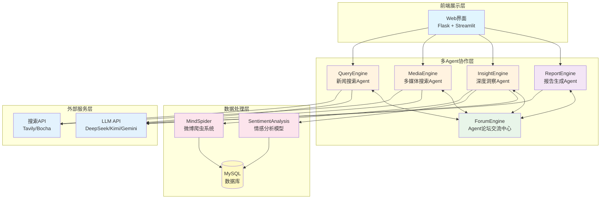
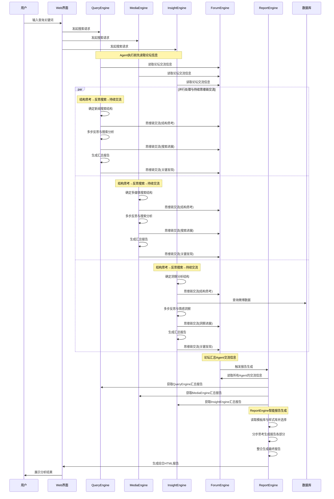

<div align="center">

  <!-- # 📊 Weibo Public Opinion Analysis System  -->

  

  [](https://github.com/666ghj/Weibo_PublicOpinion_AnalysisSystem/stargazers)
  [](https://github.com/666ghj/Weibo_PublicOpinion_AnalysisSystem/network)
  [](https://github.com/666ghj/Weibo_PublicOpinion_AnalysisSystem/issues)
  [](https://github.com/666ghj/Weibo_PublicOpinion_AnalysisSystem/graphs/contributors)
  [](https://github.com/666ghj/Weibo_PublicOpinion_AnalysisSystem/blob/main/LICENSE)

</div>

<div align="center">

</div>

## 项目概述

**Weibo舆情分析多智能体系统** 是一个从零构建的创新型舆情分析平台，采用多Agent协作架构，致力于提供准确、实时、全面的微博舆情监测与分析服务。系统通过多个专门化的AI Agent协同工作，实现了从数据采集、情感分析到报告生成的全流程自动化。

### 核心特色

- **多智能体协作架构**：5个专门化Agent协同工作，各司其职
- **全方位数据采集**：整合微博爬虫、新闻搜索、网络信息多维度数据源
- **深度情感分析**：基于微调BERT/GPT-2/Qwen模型的精准情感识别
- **智能报告生成**：自动生成结构化HTML分析报告
- **Agent论坛交流**：Forum Engine提供Agent间信息共享和协作决策平台
- **高性能异步处理**：支持并发处理多个舆情任务

## 系统架构

### 整体架构图



### 数据流程图



## 项目结构

```
Weibo_PublicOpinion_AnalysisSystem/
├── QueryEngine/              # web查询引擎Agent
│   ├── agent.py             # Agent主逻辑
│   ├── llms/                # LLM接口封装
│   ├── nodes/               # 处理节点
│   ├── tools/               # 搜索工具
│   └── utils/               # 工具函数
├── MediaEngine/              # 媒体引擎Agent
│   └── (类似结构)
├── InsightEngine/            # 数据库引擎Agent
│   └── (类似结构)
├── ReportEngine/             # 报告生成Agent
│   ├── report_template/     # 报告模板
│   └── flask_interface.py   # API接口
├── ForumEgine/              # 论坛交流Agent
│   └── monitor.py           # 论坛交流管理器
├── MindSpider/              # 微博爬虫系统
│   ├── BroadTopicExtraction/   # 话题提取
│   ├── DeepSentimentCrawling/  # 深度爬取
│   └── schema/                  # 数据库结构
├── SentimentAnalysisModel/   # 情感分析模型
│   ├── BertTopicDetection_Finetuned/
│   ├── WeiboSentiment_Finetuned/
│   └── WeiboSentiment_MachineLearning/
├── SingleEngineApp/         # Streamlit应用
├── templates/               # Flask模板
├── static/                  # 静态资源
├── logs/                    # 运行日志
├── app.py                   # 主应用入口
├── config.py                # 配置文件
└── requirements.txt         # 依赖包
```

## 快速开始

### 环境要求

- **操作系统**: Windows 10/11
- **Python版本**: 3.11+
- **Conda**: Anaconda或Miniconda
- **数据库**: MySQL 8.0+
- **内存**: 建议8GB以上

### 1. 创建Conda环境

```bash
# 创建名为pytorch_python11的conda环境
conda create -n pytorch_python11 python=3.11
conda activate pytorch_python11
```

### 2. 安装依赖包

```bash
# 基础依赖安装
pip install -r requirements.txt

# 如果需要情感分析功能，安装PyTorch（根据CUDA版本选择）
# CPU版本
pip install torch torchvision torchaudio

# CUDA 11.8版本
pip install torch torchvision torchaudio --index-url https://download.pytorch.org/whl/cu118

# 安装transformers（用于BERT/GPT模型）
pip install transformers scikit-learn xgboost
```

### 3. 安装Playwright浏览器驱动

```bash
# 安装浏览器驱动（用于爬虫功能）
playwright install chromium
```

### 4. 配置系统

#### 4.1 配置API密钥

编辑 `config.py` 文件，填入您的API密钥：

```python
# MySQL数据库配置
DB_HOST = "localhost"
DB_PORT = 3306
DB_USER = "your_username"
DB_PASSWORD = "your_password"
DB_NAME = "weibo_analysis"
DB_CHARSET = "utf8mb4"

# DeepSeek API（申请地址：https://www.deepseek.com/）
DEEPSEEK_API_KEY = "your_deepseek_api_key"

# Tavily搜索API（申请地址：https://www.tavily.com/）
TAVILY_API_KEY = "your_tavily_api_key"

# Kimi API（申请地址：https://www.kimi.com/）
KIMI_API_KEY = "your_kimi_api_key"

# Gemini API（申请地址：https://api.chataiapi.com/）
GEMINI_API_KEY = "your_gemini_api_key"

# 博查搜索API（申请地址：https://open.bochaai.com/）
BOCHA_Web_Search_API_KEY = "your_bocha_api_key"

# 硅基流动API（申请地址：https://siliconflow.cn/）
GUIJI_QWEN3_API_KEY = "your_guiji_api_key"
```

#### 4.2 初始化数据库

```bash
cd MindSpider
python schema/init_database.py
```

### 5. 启动系统

#### 方式一：完整系统启动（推荐）

```bash
# 在项目根目录下，激活conda环境
conda activate pytorch_python11

# 启动主应用（自动启动所有Agent）
python app.py
```

访问 http://localhost:5000 即可使用系统

#### 方式二：单独启动某个Agent

```bash
# 启动QueryEngine
streamlit run SingleEngineApp/query_engine_streamlit_app.py --server.port 8503

# 启动MediaEngine  
streamlit run SingleEngineApp/media_engine_streamlit_app.py --server.port 8502

# 启动InsightEngine
streamlit run SingleEngineApp/insight_engine_streamlit_app.py --server.port 8501
```

## 使用指南

### 基础使用流程

1. **启动系统**：运行 `python app.py`，系统会自动启动所有Agent

2. **输入查询**：在Web界面搜索框输入要分析的舆情关键词

3. **Agent协作**：
   - QueryEngine：搜索新闻和官方报道，将关键发现发布到论坛
   - MediaEngine：搜索多媒体内容，与其他Agent分享重要信息
   - InsightEngine：分析微博数据和情感，在论坛中交流洞察
   - ForumEngine：提供Agent间交流平台，汇总协作信息

4. **查看结果**：
   - Agent论坛交流：查看Agent间的实时信息交换
   - 分析报告：查看基于Agent协作的综合HTML报告

### 高级配置

#### 配置爬虫系统

1. **配置爬虫参数**：
```python
# MindSpider/config.py
CRAWLER_CONFIG = {
    'max_pages': 100,        # 最大爬取页数
    'delay': 1,              # 请求延迟（秒）
    'timeout': 30,           # 超时时间（秒）
    'use_proxy': False,      # 是否使用代理
}
```

2. **运行爬虫**：
```bash
cd MindSpider
python main.py --topic "话题关键词" --days 7
```

#### 配置情感分析模型

1. **选择模型**：
   - BERT微调模型（精度高）
   - GPT-2 LoRA（速度快）
   - Qwen小模型（平衡型）
   - 机器学习基线（轻量级）

2. **模型切换**：
```python
# InsightEngine/tools/sentiment_analyzer.py
MODEL_TYPE = "bert"  # 可选: "bert", "gpt2", "qwen", "ml"
```

#### 自定义报告模板

在 `ReportEngine/report_template/` 目录下创建新模板：

```markdown
# 自定义报告模板
## 舆情概览
${overview}

## 情感分析
${sentiment_analysis}

## 关键观点
${key_insights}

## 趋势预测
${trend_prediction}
```

### 监控与日志

#### 查看系统日志

所有日志文件位于 `logs/` 目录：
- `query.log`: QueryEngine运行日志
- `media.log`: MediaEngine运行日志  
- `insight.log`: InsightEngine运行日志
- `forum.log`: ForumEngine论坛交流日志
- `report.log`: ReportEngine生成日志

#### Agent论坛交流

ForumEngine提供多Agent协作交流功能：
1. Agent行动前读取论坛交流信息
2. Agent思考后决定是否分享关键发现
3. 汇总所有Agent的交流信息
4. 为ReportEngine提供协作数据基础

## 故障排除

### 常见问题

#### 1. 端口占用
```bash
# 查看端口占用（Windows）
netstat -ano | findstr :5000
netstat -ano | findstr :8501

# 结束占用进程
taskkill /F /PID <进程ID>
```

#### 2. 编码问题
```python
# 在代码开头添加
import sys
import os
os.environ['PYTHONIOENCODING'] = 'utf-8'
os.environ['PYTHONUTF8'] = '1'
```

#### 3. Playwright安装失败
```bash
# 手动安装
python -m playwright install chromium --with-deps
```

#### 4. MySQL连接失败
- 检查MySQL服务是否启动
- 确认用户权限配置
- 检查防火墙设置

## 贡献指南

我们欢迎所有形式的贡献！

1. Fork项目
2. 创建Feature分支 (`git checkout -b feature/AmazingFeature`)
3. 提交更改 (`git commit -m 'Add some AmazingFeature'`)
4. 推送到分支 (`git push origin feature/AmazingFeature`)
5. 开启Pull Request

## 许可证

本项目采用 MIT 许可证。详见 [LICENSE](LICENSE) 文件。

## 联系我们

- 项目地址：[https://github.com/666ghj/Weibo_PublicOpinion_AnalysisSystem](https://github.com/666ghj/Weibo_PublicOpinion_AnalysisSystem)
- 邮箱：670939375@qq.com
- Issues：[项目Issues](https://github.com/666ghj/Weibo_PublicOpinion_AnalysisSystem/issues)
