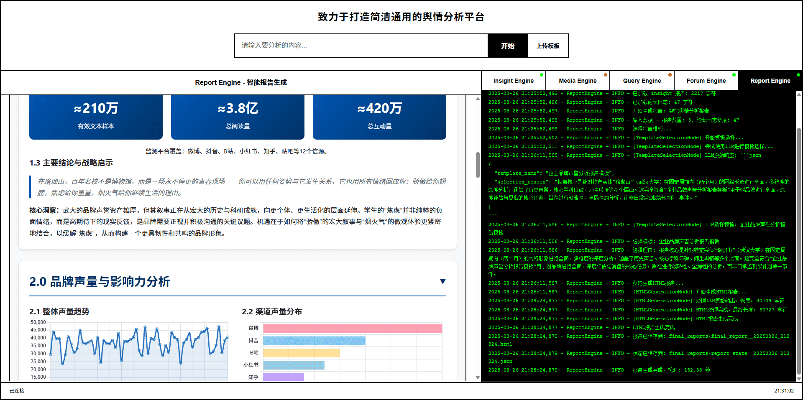

<div align="center">


<a href="https://trendshift.io/repositories/12461" target="_blank"></a>

<a href="https://leaflow.net/" target="_blank"></a>

[](https://github.com/666ghj/Weibo_PublicOpinion_AnalysisSystem/stargazers)
[](https://github.com/666ghj/Weibo_PublicOpinion_AnalysisSystem/watchers)
[](https://github.com/666ghj/Weibo_PublicOpinion_AnalysisSystem/network)
[](https://github.com/666ghj/Weibo_PublicOpinion_AnalysisSystem/issues)
[](https://github.com/666ghj/Weibo_PublicOpinion_AnalysisSystem/pulls)

[](https://github.com/666ghj/Weibo_PublicOpinion_AnalysisSystem/blob/main/LICENSE)
[](https://github.com/666ghj/Weibo_PublicOpinion_AnalysisSystem)
[](https://hub.docker.com/)


[English](./README-EN.md) | [中文文档](./README.md)

</div>

## ⚡ 项目概述

“**微舆**” 是一个从0实现的创新型 多智能体 舆情分析系统，不止微博，全平台简洁通用。

查看系统以“武汉大学舆情”为例，生成的研究报告：[武汉大学品牌声誉深度分析报告](./final_reports/final_report__20250827_131630.html)

不仅仅体现在报告质量上，相比同类产品，我们拥有🚀六大优势：

1. **AI驱动的全域监控**：AI爬虫集群7x24小时不间断作业，全面覆盖微博、小红书、抖音、快手等10+国内外关键社媒。不仅实时捕获热点内容，更能下钻至海量用户评论，让您听到最真实、最广泛的大众声音。

2. **超越LLM的复合分析引擎**：我们不仅依赖设计的5类专业Agent，更融合了微调模型、统计模型等中间件。通过多模型协同工作，确保了分析结果的深度、准度与多维视角。

3. **强大的多模态能力**：突破图文限制，能深度解析抖音、快手等短视频内容，并精准提取现代搜索引擎中的天气、日历、股票等结构化多模态信息卡片，让您全面掌握舆情动态。

4. **Agent“论坛”协作机制**：为不同Agent赋予独特的工具集与思维模式，引入辩论主持人模型，通过“论坛”机制进行链式思维碰撞与辩论。这不仅避免了单一模型的思维局限与交流导致的同质化，更催生出更高质量的集体智能与决策支持。

5. **公私域数据无缝融合**：平台不仅分析公开舆情，还提供高安全性的接口，支持您将内部业务数据库与舆情数据无缝集成。打通数据壁垒，为垂直业务提供“外部趋势+内部洞察”的强大分析能力。

6. **轻量化与高扩展性框架**：基于纯Python模块化设计，实现轻量化、一键式部署。代码结构清晰，开发者可轻松集成自定义模型与业务逻辑，实现平台的快速扩展与深度定制。

**始于舆情，而不止于舆情**。“微舆”的目标，是成为驱动一切业务场景的简洁通用的数据分析引擎。

> 举个例子. 你只需简单修改Agent工具集的api参数与prompt，就可以把他变成一个金融领域的市场分析系统

<div align="center">


告别传统的数据看板，在“微舆”，一切由一个简单的问题开始，您只需像对话一样，提出您的分析需求
</div>

## 🏗️ 系统架构

### 整体架构图

**Insight Agent** 私有数据库挖掘：私有舆情数据库深度分析AI代理

**Media Agent** 多模态内容分析：具备强大多模态能力的AI代理

**Query Agent** 精准信息搜索：具备国内外网页搜索能力的AI代理

**Report Agent** 智能报告生成：内置模板的多轮报告生成AI代理

<div align="center">

</div>

### 一次完整分析流程

| 步骤 | 阶段名称 | 主要操作 | 参与组件 | 循环特性 |
|------|----------|----------|----------|----------|
| 1 | 用户提问 | Flask主应用接收查询 | Flask主应用 | - |
| 2 | 并行启动 | 三个Agent同时开始工作 | Query Agent、Media Agent、Insight Agent | - |
| 3 | 初步分析 | 各Agent使用专属工具进行概览搜索 | 各Agent + 专属工具集 | - |
| 4 | 策略制定 | 基于初步结果制定分块研究策略 | 各Agent内部决策模块 | - |
| 5-N | **循环阶段** | **论坛协作 + 深度研究** | **ForumEngine + 所有Agent** | **多轮循环** |
| 5.1 | 深度研究 | 各Agent基于论坛主持人引导进行专项搜索 | 各Agent + 反思机制 + 论坛引导 | 每轮循环 |
| 5.2 | 论坛协作 | ForumEngine监控Agent发言并生成主持人总结 | ForumEngine + LLM主持人 | 每轮循环 |
| 5.3 | 交流融合 | 各Agent根据讨论调整研究方向 | 各Agent + forum_reader工具 | 每轮循环 |
| N+1 | 结果整合 | Report Agent收集所有分析结果和论坛内容 | Report Agent | - |
| N+2 | 报告生成 | 动态选择模板和样式，多轮生成最终报告 | Report Agent + 模板引擎 | - |

### 项目代码结构树

```
Weibo_PublicOpinion_AnalysisSystem/
├── QueryEngine/                   # 国内外新闻广度搜索Agent
│   ├── agent.py                   # Agent主逻辑
│   ├── llms/                      # LLM接口封装
│   ├── nodes/                     # 处理节点
│   ├── tools/                     # 搜索工具
│   ├── utils/                     # 工具函数
│   └── ...                        # 其他模块
├── MediaEngine/                   # 强大的多模态理解Agent
│   ├── agent.py                   # Agent主逻辑
│   ├── nodes/                     # 处理节点
│   ├── llms/                      # LLM接口
│   ├── tools/                     # 搜索工具
│   ├── utils/                     # 工具函数
│   └── ...                        # 其他模块
├── InsightEngine/                 # 私有数据库挖掘Agent
│   ├── agent.py                   # Agent主逻辑
│   ├── llms/                      # LLM接口封装
│   │   ├── deepseek.py            # DeepSeek API
│   │   ├── kimi.py                # Kimi API
│   │   ├── openai_llm.py          # OpenAI格式API
│   │   └── base.py                # LLM基类
│   ├── nodes/                     # 处理节点
│   │   ├── base_node.py           # 基础节点类
│   │   ├── formatting_node.py     # 格式化节点
│   │   ├── report_structure_node.py # 报告结构节点
│   │   ├── search_node.py         # 搜索节点
│   │   └── summary_node.py        # 总结节点
│   ├── tools/                     # 数据库查询和分析工具
│   │   ├── keyword_optimizer.py   # Qwen关键词优化中间件
│   │   ├── search.py              # 数据库操作工具集
│   │   └── sentiment_analyzer.py  # 情感分析集成工具
│   ├── state/                     # 状态管理
│   │   ├── __init__.py
│   │   └── state.py               # Agent状态定义
│   ├── prompts/                   # 提示词模板
│   │   ├── __init__.py
│   │   └── prompts.py             # 各类提示词
│   └── utils/                     # 工具函数
│       ├── __init__.py
│       ├── config.py              # 配置管理
│       └── text_processing.py     # 文本处理工具
├── ReportEngine/                  # 多轮报告生成Agent
│   ├── agent.py                   # Agent主逻辑
│   ├── llms/                      # LLM接口
│   │   └── gemini.py              # Gemini API专用
│   ├── nodes/                     # 报告生成节点
│   │   ├── template_selection.py  # 模板选择节点
│   │   └── html_generation.py     # HTML生成节点
│   ├── report_template/           # 报告模板库
│   │   ├── 社会公共热点事件分析.md
│   │   ├── 商业品牌舆情监测.md
│   │   └── ...                    # 更多模板
│   └── flask_interface.py         # Flask API接口
├── ForumEngine/                   # 论坛引擎简易实现
│   ├── monitor.py                 # 日志监控和论坛管理
│   └── llm_host.py                # 论坛主持人LLM模块
├── MindSpider/                    # 微博爬虫系统
│   ├── main.py                    # 爬虫主程序
│   ├── config.py                  # 爬虫配置文件
│   ├── BroadTopicExtraction/      # 话题提取模块
│   │   ├── database_manager.py    # 数据库管理器
│   │   ├── get_today_news.py      # 今日新闻获取
│   │   ├── main.py                # 话题提取主程序
│   │   └── topic_extractor.py     # 话题提取器
│   ├── DeepSentimentCrawling/     # 深度舆情爬取
│   │   ├── keyword_manager.py     # 关键词管理器
│   │   ├── main.py                # 深度爬取主程序
│   │   ├── MediaCrawler/          # 媒体爬虫核心
│   │   └── platform_crawler.py    # 平台爬虫管理
│   └── schema/                    # 数据库结构
│       ├── db_manager.py          # 数据库管理器
│       ├── init_database.py       # 数据库初始化
│       └── mindspider_tables.sql  # 数据库表结构
├── SentimentAnalysisModel/        # 情感分析模型集合
│   ├── WeiboSentiment_Finetuned/  # 微调BERT/GPT-2模型
│   ├── WeiboMultilingualSentiment/# 多语言情感分析（推荐）
│   ├── WeiboSentiment_SmallQwen/  # 小参数Qwen3微调
│   └── WeiboSentiment_MachineLearning/ # 传统机器学习方法
├── SingleEngineApp/               # 单独Agent的Streamlit应用
│   ├── query_engine_streamlit_app.py
│   ├── media_engine_streamlit_app.py
│   └── insight_engine_streamlit_app.py
├── templates/                     # Flask模板
│   └── index.html                 # 主界面前端
├── static/                        # 静态资源
├── logs/                          # 运行日志目录
├── final_reports/                 # 最终生成的HTML报告文件
├── utils/                         # 通用工具函数
│   ├── forum_reader.py            # Agent间论坛通信
│   └── retry_helper.py            # 网络请求重试机制工具
├── app.py                         # Flask主应用入口
├── config.py                      # 全局配置文件
└── requirements.txt               # Python依赖包清单
```

## 🚀 快速开始

> 如果你是初次学习一个Agent系统的搭建，可以从一个非常简单的demo开始：[Deep Search Agent Demo](https://github.com/666ghj/DeepSearchAgent-Demo)

### 环境要求

- **操作系统**: Windows、Linux、MacOS
- **Python版本**: 3.9+
- **Conda**: Anaconda或Miniconda
- **数据库**: MySQL（可选择我们的云数据库服务）
- **内存**: 建议2GB以上

### 1. 创建Conda环境

```bash
# 创建conda环境
conda create -n your_conda_name python=3.11
conda activate your_conda_name
```

### 2. 安装依赖包

```bash
# 基础依赖安装
pip install -r requirements.txt

#========下面是可选项========
# 如果需要本地情感分析功能，安装PyTorch
# CPU版本
pip install torch torchvision torchaudio

# CUDA 11.8版本（如有GPU）
pip install torch torchvision torchaudio --index-url https://download.pytorch.org/whl/cu118

# 安装transformers等AI相关依赖
pip install transformers scikit-learn xgboost
```

### 3. 安装Playwright浏览器驱动

```bash
# 安装浏览器驱动（用于爬虫功能）
playwright install chromium
```

### 4. 配置系统

#### 4.1 配置API密钥

编辑 `config.py` 文件，填入您的API密钥（您也可以选择自己的模型、搜索代理）：

```python
# MySQL数据库配置
DB_HOST = "localhost"
DB_PORT = 3306
DB_USER = "your_username"
DB_PASSWORD = "your_password"
DB_NAME = "weibo_analysis"
DB_CHARSET = "utf8mb4"

# DeepSeek API（申请地址：https://www.deepseek.com/）
DEEPSEEK_API_KEY = "your_deepseek_api_key"

# Tavily搜索API（申请地址：https://www.tavily.com/）
TAVILY_API_KEY = "your_tavily_api_key"

# Kimi API（申请地址：https://www.kimi.com/）
KIMI_API_KEY = "your_kimi_api_key"

# Gemini API（申请地址：https://api.chataiapi.com/）
GEMINI_API_KEY = "your_gemini_api_key"

# 博查搜索API（申请地址：https://open.bochaai.com/）
BOCHA_Web_Search_API_KEY = "your_bocha_api_key"

# 硅基流动API（申请地址：https://siliconflow.cn/）
GUIJI_QWEN3_API_KEY = "your_guiji_api_key"
```

#### 4.2 数据库初始化

**选择1：使用本地数据库**
```bash
# 本地MySQL数据库初始化
cd MindSpider
python schema/init_database.py
```

**选择2：使用云数据库服务（推荐）**

我们提供便捷的云数据库服务，包含日均10万+真实舆情数据，目前推广期间**免费申请**！

- 真实舆情数据，实时更新
- 多维度标签分类
- 高可用云端服务
- 专业技术支持

**联系我们申请免费云数据库访问：📧 670939375@qq.com**

### 5. 启动系统

#### 5.1 完整系统启动（推荐）

```bash
# 在项目根目录下，激活conda环境
conda activate your_conda_name

# 启动主应用即可
python app.py
```

> 注：数据爬取需要单独操作，见5.3指引

访问 http://localhost:5000 即可使用完整系统

#### 5.2 单独启动某个Agent

```bash
# 启动QueryEngine
streamlit run SingleEngineApp/query_engine_streamlit_app.py --server.port 8503

# 启动MediaEngine  
streamlit run SingleEngineApp/media_engine_streamlit_app.py --server.port 8502

# 启动InsightEngine
streamlit run SingleEngineApp/insight_engine_streamlit_app.py --server.port 8501
```

#### 5.3 爬虫系统单独使用

这部分有详细的配置文档：[MindeSpider使用说明](./MindSpider/README.md)

```bash
# 进入爬虫目录
cd MindSpider

# 项目初始化
python main.py --setup

# 运行完整爬虫流程
python main.py --complete --date 2024-01-20

# 仅运行话题提取
python main.py --broad-topic --date 2024-01-20

# 仅运行深度爬取
python main.py --deep-sentiment --platforms xhs dy wb
```

## ⚙️ 高级配置

### 修改关键参数

#### Agent配置参数

每个Agent都有专门的配置文件，可根据需求调整，下面是部分示例：

```python
# QueryEngine/utils/config.py
class Config:
    max_reflections = 2           # 反思轮次
    max_search_results = 15       # 最大搜索结果数
    max_content_length = 8000     # 最大内容长度
    
# MediaEngine/utils/config.py  
class Config:
    comprehensive_search_limit = 10  # 综合搜索限制
    web_search_limit = 15           # 网页搜索限制
    
# InsightEngine/utils/config.py
class Config:
    default_search_topic_globally_limit = 200    # 全局搜索限制
    default_get_comments_limit = 500             # 评论获取限制
    max_search_results_for_llm = 50              # 传给LLM的最大结果数
```

#### 情感分析模型配置

```python
# InsightEngine/tools/sentiment_analyzer.py
SENTIMENT_CONFIG = {
    'model_type': 'multilingual',     # 可选: 'bert', 'multilingual', 'qwen'等
    'confidence_threshold': 0.8,      # 置信度阈值
    'batch_size': 32,                 # 批处理大小
    'max_sequence_length': 512,       # 最大序列长度
}
```

### 接入不同的LLM模型

系统支持多种LLM提供商，可在各Agent的配置中切换：

```python
# 在各Engine的utils/config.py中配置
class Config:
    default_llm_provider = "deepseek"  # 可选: "deepseek", "openai", "kimi", "gemini"，"qwen"等
    
    # DeepSeek配置
    deepseek_api_key = "your_api_key"
    deepseek_model = "deepseek-chat"
    
    # OpenAI兼容配置
    openai_api_key = "your_api_key"
    openai_model = "gpt-3.5-turbo"
    openai_base_url = "https://api.openai.com/v1"
    
    # Kimi配置
    kimi_api_key = "your_api_key"  
    kimi_model = "moonshot-v1-8k"
    
    # Gemini配置
    gemini_api_key = "your_api_key"
    gemini_model = "gemini-pro"
```

### 更改情感分析模型

系统集成了多种情感分析方法，可根据需求选择：

#### 1. 多语言情感分析

```bash
cd SentimentAnalysisModel/WeiboMultilingualSentiment
python predict.py --text "This product is amazing!" --lang "en"
```

#### 2. 小参数Qwen3微调

```bash
cd SentimentAnalysisModel/WeiboSentiment_SmallQwen
python predict_universal.py --text "这次活动办得很成功"
```

#### 3. 基于BERT的微调模型

```bash
# 使用BERT中文模型
cd SentimentAnalysisModel/WeiboSentiment_Finetuned/BertChinese-Lora
python predict.py --text "这个产品真的很不错"
```

#### 4. GPT-2 LoRA微调模型

```bash
cd SentimentAnalysisModel/WeiboSentiment_Finetuned/GPT2-Lora
python predict.py --text "今天心情不太好"
```

#### 5. 传统机器学习方法

```bash
cd SentimentAnalysisModel/WeiboSentiment_MachineLearning
python predict.py --model_type "svm" --text "服务态度需要改进"
```

### 接入自定义业务数据库

#### 1. 修改数据库连接配置

```python
# config.py 中添加您的业务数据库配置
BUSINESS_DB_HOST = "your_business_db_host"
BUSINESS_DB_PORT = 3306
BUSINESS_DB_USER = "your_business_user"
BUSINESS_DB_PASSWORD = "your_business_password"
BUSINESS_DB_NAME = "your_business_database"
```

#### 2. 创建自定义数据访问工具

```python
# InsightEngine/tools/custom_db_tool.py
class CustomBusinessDBTool:
    """自定义业务数据库查询工具"""
    
    def __init__(self):
        self.connection_config = {
            'host': config.BUSINESS_DB_HOST,
            'port': config.BUSINESS_DB_PORT,
            'user': config.BUSINESS_DB_USER,
            'password': config.BUSINESS_DB_PASSWORD,
            'database': config.BUSINESS_DB_NAME,
        }
    
    def search_business_data(self, query: str, table: str):
        """查询业务数据"""
        # 实现您的业务逻辑
        pass
    
    def get_customer_feedback(self, product_id: str):
        """获取客户反馈数据"""
        # 实现客户反馈查询逻辑
        pass
```

#### 3. 集成到InsightEngine

```python
# InsightEngine/agent.py 中集成自定义工具
from .tools.custom_db_tool import CustomBusinessDBTool

class DeepSearchAgent:
    def __init__(self, config=None):
        # ... 其他初始化代码
        self.custom_db_tool = CustomBusinessDBTool()
    
    def execute_custom_search(self, query: str):
        """执行自定义业务数据搜索"""
        return self.custom_db_tool.search_business_data(query, "your_table")
```

### 自定义报告模板

#### 1. 在Web界面中上传

系统支持上传自定义模板文件（.md或.txt格式），可在生成报告时选择使用。

#### 2. 创建模板文件

在 `ReportEngine/report_template/` 目录下创建新的模板，我们的Agent会自行选用最合适的模板。

## 🤝 贡献指南

我们欢迎所有形式的贡献！

### 如何贡献

1. **Fork项目**到您的GitHub账号
2. **创建Feature分支**：`git checkout -b feature/AmazingFeature`
3. **提交更改**：`git commit -m 'Add some AmazingFeature'`
4. **推送到分支**：`git push origin feature/AmazingFeature`
5. **开启Pull Request**

### 开发规范

- 代码遵循PEP8规范
- 提交信息使用清晰的中英文描述
- 新功能需要包含相应的测试用例
- 更新相关文档

## 🦖 下一步开发计划

现在系统只完成了"三板斧"中的前两步，即：输入要求->详细分析，还缺少一步预测，直接将他继续交给LLM是不具有说服力的。

<div align="center">

</div>

目前我们经过很长一段时间的爬取收集，拥有了大量全网话题热度随时间、爆点等的变化趋势热度数据，已经具备了可以开发预测模型的条件。我们团队将运用时序模型、图神经网络、多模态融合等预测模型技术储备于此，实现真正基于数据驱动的舆情预测功能。

## ⚠️ 免责声明

**重要提醒：本项目仅供学习、学术研究和教育目的使用**

1. **合规性声明**：
   - 本项目中的所有代码、工具和功能均仅供学习、学术研究和教育目的使用
   - 严禁将本项目用于任何商业用途或盈利性活动
   - 严禁将本项目用于任何违法、违规或侵犯他人权益的行为

2. **爬虫功能免责**：
   - 项目中的爬虫功能仅用于技术学习和研究目的
   - 使用者必须遵守目标网站的robots.txt协议和使用条款
   - 使用者必须遵守相关法律法规，不得进行恶意爬取或数据滥用
   - 因使用爬虫功能产生的任何法律后果由使用者自行承担

3. **数据使用免责**：
   - 项目涉及的数据分析功能仅供学术研究使用
   - 严禁将分析结果用于商业决策或盈利目的
   - 使用者应确保所分析数据的合法性和合规性

4. **技术免责**：
   - 本项目按"现状"提供，不提供任何明示或暗示的保证
   - 作者不对使用本项目造成的任何直接或间接损失承担责任
   - 使用者应自行评估项目的适用性和风险

5. **责任限制**：
   - 使用者在使用本项目前应充分了解相关法律法规
   - 使用者应确保其使用行为符合当地法律法规要求
   - 因违反法律法规使用本项目而产生的任何后果由使用者自行承担

**请在使用本项目前仔细阅读并理解上述免责声明。使用本项目即表示您已同意并接受上述所有条款。**

## 📄 许可证

本项目采用 [GPL-2.0许可证](LICENSE)。详细信息请参阅LICENSE文件。

## 🎉 支持与联系

### 获取帮助

- **项目主页**：[GitHub仓库](https://github.com/666ghj/Weibo_PublicOpinion_AnalysisSystem)
- **问题反馈**：[Issues页面](https://github.com/666ghj/Weibo_PublicOpinion_AnalysisSystem/issues)
- **功能建议**：[Discussions页面](https://github.com/666ghj/Weibo_PublicOpinion_AnalysisSystem/discussions)

### 联系方式

- 📧 **邮箱**：670939375@qq.com

### 商务合作

- 🏢 **企业定制开发**
- 📊 **大数据服务**
- 🎓 **学术合作**
- 💼 **技术培训**

### 云服务申请

**免费云数据库服务申请**：
📧 发送邮件至：670939375@qq.com  
📝 标题：微舆云数据库申请  
📝 说明：您的使用场景和需求

## 👥 贡献者

感谢以下优秀的贡献者们：

[](https://github.com/666ghj/Weibo_PublicOpinion_AnalysisSystem/graphs/contributors)

---

<div align="center">

**⭐ 如果这个项目对您有帮助，请给我们一个星标！**

</div>
