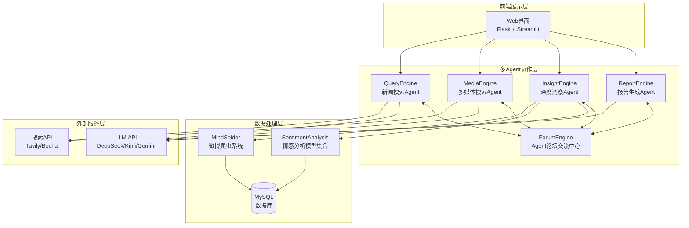

<div align="center">


# 微舆 - 致力于打造简洁通用的舆情分析平台

[](https://github.com/666ghj/Weibo_PublicOpinion_AnalysisSystem/stargazers)
[](https://github.com/666ghj/Weibo_PublicOpinion_AnalysisSystem/network)
[](https://github.com/666ghj/Weibo_PublicOpinion_AnalysisSystem/issues)
[](https://github.com/666ghj/Weibo_PublicOpinion_AnalysisSystem/blob/main/LICENSE)

[English](./README-EN.md) | [中文文档](./README.md)

</div>

<div align="center">

</div>

## 📝 项目概述

**微博舆情分析多智能体系统**是一个从零构建的创新型舆情分析平台，采用多Agent协作架构，致力于提供准确、实时、全面的微博舆情监测与分析服务。系统通过五个专门化的AI Agent协同工作，实现了从数据采集、情感分析到报告生成的全流程自动化。

### 🚀 核心亮点

- **多智能体协作架构**：5个专门化Agent各司其职，协同工作完成舆情分析全流程
- **全方位数据采集**：整合微博爬虫、新闻搜索、多媒体内容等多维度数据源
- **深度情感分析**：基于微调BERT/GPT-2/Qwen模型的精准多语言情感识别
- **智能报告生成**：自动生成结构化HTML分析报告，支持自定义模板
- **Agent论坛交流**：ForumEngine提供Agent间信息共享和协作决策平台
- **高性能异步处理**：支持并发处理多个舆情任务，实时状态监控
- **云端数据支持**：提供便捷云数据库服务，日均10万+真实数据

## 🏗️ 系统架构

### 整体架构图



### Agent协作流程

系统核心工作流程基于多Agent协作模式：

1. **QueryEngine（新闻查询Agent）**：使用Tavily API搜索权威新闻报道，提供官方信息源
2. **MediaEngine（多媒体搜索Agent）**：通过Bocha API进行多模态内容搜索，获取社交媒体观点
3. **InsightEngine（深度洞察Agent）**：查询本地微博数据库，结合多种情感分析模型进行深度分析
4. **ForumEngine（论坛监控Agent）**：实时监控各Agent日志输出，提取关键信息并促进协作
5. **ReportEngine（报告生成Agent）**：基于所有Agent的分析结果，使用Gemini LLM生成综合HTML报告

### 项目代码结构

```
Weibo_PublicOpinion_AnalysisSystem/
├── QueryEngine/                    # 新闻查询引擎Agent
│   ├── agent.py                   # Agent主逻辑
│   ├── llms/                      # LLM接口封装
│   ├── nodes/                     # 处理节点
│   ├── tools/                     # 搜索工具
│   └── utils/                     # 工具函数
├── MediaEngine/                    # 多媒体搜索引擎Agent
│   ├── agent.py                   # Agent主逻辑
│   ├── llms/                      # LLM接口
│   ├── tools/                     # 搜索工具
│   └── ...                       # 其他模块
├── InsightEngine/                 # 数据洞察引擎Agent
│   ├── agent.py                   # Agent主逻辑
│   ├── llms/                      # LLM接口封装
│   │   ├── deepseek.py           # DeepSeek API
│   │   ├── kimi.py               # Kimi API
│   │   ├── openai_llm.py         # OpenAI格式API
│   │   └── base.py               # LLM基类
│   ├── nodes/                     # 处理节点
│   │   ├── first_search_node.py  # 首次搜索节点
│   │   ├── reflection_node.py    # 反思节点
│   │   ├── summary_nodes.py      # 总结节点
│   │   ├── search_node.py        # 搜索节点
│   │   ├── sentiment_node.py     # 情感分析节点
│   │   └── insight_node.py       # 洞察生成节点
│   ├── tools/                     # 数据库查询和分析工具
│   │   ├── media_crawler_db.py   # 数据库查询工具
│   │   └── sentiment_analyzer.py # 情感分析集成工具
│   ├── state/                     # 状态管理
│   │   ├── __init__.py
│   │   └── state.py              # Agent状态定义
│   ├── prompts/                   # 提示词模板
│   │   ├── __init__.py
│   │   └── prompts.py            # 各类提示词
│   └── utils/                     # 工具函数
│       ├── __init__.py
│       ├── config.py             # 配置管理
│       └── helpers.py            # 辅助函数
├── ReportEngine/                  # 报告生成引擎Agent
│   ├── agent.py                   # Agent主逻辑
│   ├── llms/                      # LLM接口
│   │   └── gemini.py             # Gemini API专用
│   ├── nodes/                     # 报告生成节点
│   │   ├── template_selection.py # 模板选择节点
│   │   └── html_generation.py    # HTML生成节点
│   ├── report_template/           # 报告模板库
│   │   ├── 社会公共热点事件分析.md
│   │   ├── 商业品牌舆情监测.md
│   │   └── ...                   # 更多模板
│   └── flask_interface.py         # Flask API接口
├── ForumEngine/                   # 论坛交流引擎Agent
│   └── monitor.py                 # 日志监控和论坛管理
├── MindSpider/                    # 微博爬虫系统
│   ├── main.py                    # 爬虫主程序
│   ├── BroadTopicExtraction/      # 话题提取模块
│   │   ├── get_today_news.py     # 今日新闻获取
│   │   └── topic_extractor.py    # 话题提取器
│   ├── DeepSentimentCrawling/     # 深度情感爬取
│   │   ├── MediaCrawler/         # 媒体爬虫核心
│   │   └── platform_crawler.py  # 平台爬虫管理
│   └── schema/                    # 数据库结构
│       └── init_database.py      # 数据库初始化
├── SentimentAnalysisModel/        # 情感分析模型集合
│   ├── WeiboSentiment_Finetuned/  # 微调BERT/GPT-2模型
│   ├── WeiboMultilingualSentiment/ # 多语言情感分析
│   ├── WeiboSentiment_SmallQwen/   # 小型Qwen模型
│   └── WeiboSentiment_MachineLearning/ # 传统机器学习方法
├── SingleEngineApp/               # 单独Agent的Streamlit应用
│   ├── query_engine_streamlit_app.py
│   ├── media_engine_streamlit_app.py
│   └── insight_engine_streamlit_app.py
├── templates/                     # Flask模板
│   └── index.html                # 主界面模板
├── static/                        # 静态资源
├── logs/                         # 运行日志目录
├── app.py                        # Flask主应用入口
├── config.py                     # 全局配置文件
└── requirements.txt              # Python依赖包清单
```

## 🚀 快速开始

### 环境要求

- **操作系统**: Windows 10/11（Linux/macOS也支持）
- **Python版本**: 3.11+
- **Conda**: Anaconda或Miniconda
- **数据库**: MySQL 8.0+（可选择我们的云数据库服务）
- **内存**: 建议8GB以上

### 1. 创建Conda环境

```bash
# 创建名为pytorch_python11的conda环境
conda create -n pytorch_python11 python=3.11
conda activate pytorch_python11
```

### 2. 安装依赖包

```bash
# 基础依赖安装
pip install -r requirements.txt

# 如果需要本地情感分析功能，安装PyTorch
# CPU版本
pip install torch torchvision torchaudio

# CUDA 11.8版本（如有GPU）
pip install torch torchvision torchaudio --index-url https://download.pytorch.org/whl/cu118

# 安装transformers等AI相关依赖
pip install transformers scikit-learn xgboost
```

### 3. 安装Playwright浏览器驱动

```bash
# 安装浏览器驱动（用于爬虫功能）
playwright install chromium
```

### 4. 配置系统

#### 4.1 配置API密钥

编辑 `config.py` 文件，填入您的API密钥：

```python
# MySQL数据库配置
DB_HOST = "localhost"
DB_PORT = 3306
DB_USER = "your_username"
DB_PASSWORD = "your_password"
DB_NAME = "weibo_analysis"
DB_CHARSET = "utf8mb4"

# DeepSeek API（申请地址：https://www.deepseek.com/）
DEEPSEEK_API_KEY = "your_deepseek_api_key"

# Tavily搜索API（申请地址：https://www.tavily.com/）
TAVILY_API_KEY = "your_tavily_api_key"

# Kimi API（申请地址：https://www.kimi.com/）
KIMI_API_KEY = "your_kimi_api_key"

# Gemini API（申请地址：https://api.chataiapi.com/）
GEMINI_API_KEY = "your_gemini_api_key"

# 博查搜索API（申请地址：https://open.bochaai.com/）
BOCHA_Web_Search_API_KEY = "your_bocha_api_key"

# 硅基流动API（申请地址：https://siliconflow.cn/）
GUIJI_QWEN3_API_KEY = "your_guiji_api_key"
```

#### 4.2 数据库初始化

**选择1：使用本地数据库**
```bash
# 本地MySQL数据库初始化
cd MindSpider
python schema/init_database.py
```

**选择2：使用云数据库服务（推荐）**

我们提供便捷的云数据库服务，包含日均10万+真实微博数据，目前推广期间**免费申请**！

- 真实微博数据，实时更新
- 预处理的情感标注数据
- 多维度标签分类
- 高可用云端服务
- 专业技术支持

**联系我们申请免费云数据库访问：📧 670939375@qq.com**

### 5. 启动系统

#### 5.1 完整系统启动（推荐）

```bash
# 在项目根目录下，激活conda环境
conda activate pytorch_python11

# 启动主应用（自动启动所有Agent）
python app.py
```

访问 http://localhost:5000 即可使用完整系统

#### 5.2 单独启动某个Agent

```bash
# 启动QueryEngine
streamlit run SingleEngineApp/query_engine_streamlit_app.py --server.port 8503

# 启动MediaEngine  
streamlit run SingleEngineApp/media_engine_streamlit_app.py --server.port 8502

# 启动InsightEngine
streamlit run SingleEngineApp/insight_engine_streamlit_app.py --server.port 8501
```

#### 5.3 爬虫系统单独使用

```bash
# 进入爬虫目录
cd MindSpider

# 项目初始化
python main.py --setup

# 运行完整爬虫流程
python main.py --complete --date 2024-01-20

# 仅运行话题提取
python main.py --broad-topic --date 2024-01-20

# 仅运行深度爬取
python main.py --deep-sentiment --platforms xhs dy wb
```

## 💾 数据库配置

### 本地数据库配置

1. **安装MySQL 8.0+**
2. **创建数据库**：
   ```sql
   CREATE DATABASE weibo_analysis CHARACTER SET utf8mb4 COLLATE utf8mb4_unicode_ci;
   ```
3. **运行初始化脚本**：
   ```bash
   cd MindSpider
   python schema/init_database.py
   ```

### 自动爬取配置

配置自动爬取任务，实现数据的持续更新：

```python
# MindSpider/config.py 中配置爬虫参数
CRAWLER_CONFIG = {
    'max_pages': 200,         # 最大爬取页数
    'delay': 1,               # 请求延迟（秒）
    'timeout': 30,            # 超时时间（秒）
    'platforms': ['xhs', 'dy', 'wb', 'bili'],  # 爬取平台
    'daily_keywords': 100,    # 每日关键词数量
    'max_notes_per_keyword': 50,  # 每关键词最大内容数
    'use_proxy': False,       # 是否使用代理
}
```

### 云数据库服务（推荐）

**为什么选择我们的云数据库服务？**

- **丰富数据源**：日均10万+真实微博数据，涵盖各行业热点话题
- **高质量标注**：专业团队人工标注的情感数据，准确率95%+
- **多维度分析**：包含话题分类、情感倾向、影响力评分等多维标签
- **实时更新**：24小时不间断数据采集，确保时效性
- **技术支持**：专业团队提供技术支持和定制化服务

**申请方式**：
📧 邮件联系：670939375@qq.com
📝 邮件标题：申请微博舆情云数据库访问
📝 邮件内容：请说明您的使用场景和预期数据量需求

**推广期福利**：
- 免费提供基础版云数据库访问
- 免费技术支持和部署指导
- 优先体验新功能特性

## ⚙️ 高级配置

### 修改关键参数

#### Agent配置参数

每个Agent都有专门的配置文件，可根据需求调整：

```python
# QueryEngine/utils/config.py
class Config:
    max_reflections = 2           # 反思轮次
    max_search_results = 15       # 最大搜索结果数
    max_content_length = 8000     # 最大内容长度
    
# MediaEngine/utils/config.py  
class Config:
    comprehensive_search_limit = 10  # 综合搜索限制
    web_search_limit = 15           # 网页搜索限制
    
# InsightEngine/utils/config.py
class Config:
    default_search_topic_globally_limit = 200    # 全局搜索限制
    default_get_comments_limit = 500             # 评论获取限制
    max_search_results_for_llm = 50              # 传给LLM的最大结果数
```

#### 情感分析模型配置

```python
# InsightEngine/tools/sentiment_analyzer.py
SENTIMENT_CONFIG = {
    'model_type': 'multilingual',     # 可选: 'bert', 'multilingual', 'qwen'
    'confidence_threshold': 0.8,      # 置信度阈值
    'batch_size': 32,                 # 批处理大小
    'max_sequence_length': 512,       # 最大序列长度
}
```

### 接入不同的LLM模型

系统支持多种LLM提供商，可在各Agent的配置中切换：

```python
# 在各Engine的utils/config.py中配置
class Config:
    default_llm_provider = "deepseek"  # 可选: "deepseek", "openai", "kimi", "gemini"
    
    # DeepSeek配置
    deepseek_api_key = "your_api_key"
    deepseek_model = "deepseek-chat"
    
    # OpenAI兼容配置
    openai_api_key = "your_api_key"
    openai_model = "gpt-3.5-turbo"
    openai_base_url = "https://api.openai.com/v1"
    
    # Kimi配置
    kimi_api_key = "your_api_key"  
    kimi_model = "moonshot-v1-8k"
    
    # Gemini配置
    gemini_api_key = "your_api_key"
    gemini_model = "gemini-pro"
```

### 更改情感分析模型

系统集成了多种情感分析方法，可根据需求选择：

#### 1. 基于BERT的微调模型（精度最高）

```bash
# 使用BERT中文模型
cd SentimentAnalysisModel/WeiboSentiment_Finetuned/BertChinese-Lora
python predict.py --text "这个产品真的很不错"
```

#### 2. GPT-2 LoRA微调模型（速度较快）

```bash
cd SentimentAnalysisModel/WeiboSentiment_Finetuned/GPT2-Lora
python predict.py --text "今天心情不太好"
```

#### 3. 小型Qwen模型（平衡型）

```bash
cd SentimentAnalysisModel/WeiboSentiment_SmallQwen
python predict_universal.py --text "这次活动办得很成功"
```

#### 4. 传统机器学习方法（轻量级）

```bash
cd SentimentAnalysisModel/WeiboSentiment_MachineLearning
python predict.py --model_type "svm" --text "服务态度需要改进"
```

#### 5. 多语言情感分析（支持22种语言）

```bash
cd SentimentAnalysisModel/WeiboMultilingualSentiment
python predict.py --text "This product is amazing!" --lang "en"
```

### 接入自定义业务数据库

#### 1. 修改数据库连接配置

```python
# config.py 中添加您的业务数据库配置
BUSINESS_DB_HOST = "your_business_db_host"
BUSINESS_DB_PORT = 3306
BUSINESS_DB_USER = "your_business_user"
BUSINESS_DB_PASSWORD = "your_business_password"
BUSINESS_DB_NAME = "your_business_database"
```

#### 2. 创建自定义数据访问工具

```python
# InsightEngine/tools/custom_db_tool.py
class CustomBusinessDBTool:
    """自定义业务数据库查询工具"""
    
    def __init__(self):
        self.connection_config = {
            'host': config.BUSINESS_DB_HOST,
            'port': config.BUSINESS_DB_PORT,
            'user': config.BUSINESS_DB_USER,
            'password': config.BUSINESS_DB_PASSWORD,
            'database': config.BUSINESS_DB_NAME,
        }
    
    def search_business_data(self, query: str, table: str):
        """查询业务数据"""
        # 实现您的业务逻辑
        pass
    
    def get_customer_feedback(self, product_id: str):
        """获取客户反馈数据"""
        # 实现客户反馈查询逻辑
        pass
```

#### 3. 集成到InsightEngine

```python
# InsightEngine/agent.py 中集成自定义工具
from .tools.custom_db_tool import CustomBusinessDBTool

class DeepSearchAgent:
    def __init__(self, config=None):
        # ... 其他初始化代码
        self.custom_db_tool = CustomBusinessDBTool()
    
    def execute_custom_search(self, query: str):
        """执行自定义业务数据搜索"""
        return self.custom_db_tool.search_business_data(query, "your_table")
```

### 自定义报告模板

#### 1. 创建模板文件

在 `ReportEngine/report_template/` 目录下创建新的Markdown模板：

```markdown
<!-- 企业品牌监测报告.md -->
# 企业品牌舆情监测报告

## 📊 执行摘要
{executive_summary}

## 🔍 品牌提及分析
### 提及量趋势
{mention_trend}

### 情感分布
{sentiment_distribution}

## 📈 竞品对比分析
{competitor_analysis}

## 🎯 关键观点摘要
{key_insights}

## ⚠️ 风险预警
{risk_alerts}

## 📋 改进建议
{recommendations}

---
*报告类型：企业品牌舆情监测*  
*生成时间：{generation_time}*  
*数据来源：{data_sources}*
```

#### 2. 在Web界面中使用

系统支持上传自定义模板文件（.md或.txt格式），可在生成报告时选择使用。

## 🤝 贡献指南

我们欢迎所有形式的贡献！

### 如何贡献

1. **Fork项目**到您的GitHub账号
2. **创建Feature分支**：`git checkout -b feature/AmazingFeature`
3. **提交更改**：`git commit -m 'Add some AmazingFeature'`
4. **推送到分支**：`git push origin feature/AmazingFeature`
5. **开启Pull Request**

### 贡献类型

- 🐛 Bug修复
- ✨ 新功能开发
- 📚 文档完善
- 🎨 UI/UX改进
- ⚡ 性能优化
- 🧪 测试用例添加

### 开发规范

- 代码遵循PEP8规范
- 提交信息使用清晰的中英文描述
- 新功能需要包含相应的测试用例
- 更新相关文档

## 📄 许可证

本项目采用 [MIT许可证](LICENSE)。详细信息请参阅LICENSE文件。

## 🎉 支持与联系

### 获取帮助

- **项目主页**：[GitHub仓库](https://github.com/666ghj/Weibo_PublicOpinion_AnalysisSystem)
- **问题反馈**：[Issues页面](https://github.com/666ghj/Weibo_PublicOpinion_AnalysisSystem/issues)
- **功能建议**：[Discussions页面](https://github.com/666ghj/Weibo_PublicOpinion_AnalysisSystem/discussions)

### 联系方式

- 📧 **邮箱**：670939375@qq.com
- 💬 **QQ群**：[加入技术交流群]
- 🐦 **微信**：[扫码添加技术支持]

### 商务合作

- 🏢 **企业定制开发**
- 📊 **大数据服务**
- 🎓 **学术合作**
- 💼 **技术培训**

### 云服务申请

**免费云数据库服务申请**：
📧 发送邮件至：670939375@qq.com  
📝 标题：微博舆情云数据库申请  
📝 说明：您的使用场景和需求  

## 👥 贡献者

感谢以下优秀的贡献者们：

[](https://github.com/666ghj/Weibo_PublicOpinion_AnalysisSystem/graphs/contributors)

---

<div align="center">

**⭐ 如果这个项目对您有帮助，请给我们一个星标！**

Made with ❤️ by [微博舆情分析团队](https://github.com/666ghj)

</div>
